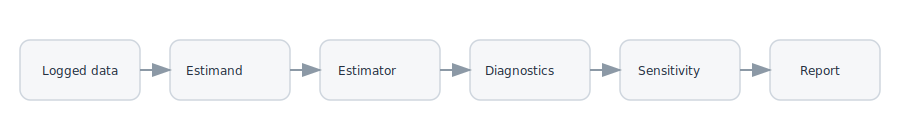

# Installation

CausalRL is available as a Python package (`causalrl`) and imported as `crl`.

## Install from PyPI

```bash
python -m pip install causalrl
```

## Install from source

```bash
git clone https://github.com/gsaco/causalrl
cd causalrl
python -m pip install -e .
```

## Optional extras

Choose extras when you need them:

```bash
python -m pip install "causalrl[docs]"
python -m pip install "causalrl[benchmarks]"
python -m pip install "causalrl[notebooks]"
python -m pip install "causalrl[behavior]"
python -m pip install "causalrl[d4rl]"
python -m pip install "causalrl[rlu]"
```

!!! tip "Recommended extras"
    - Use `causalrl[behavior]` if you need to estimate behavior propensities.
    - Use `causalrl[notebooks]` to run the walkthrough notebooks locally.
    - Use `causalrl[docs]` if you plan to build the documentation site.

!!! warning "Common pitfalls"
    - Behavior policy estimation requires `scikit-learn`.
    - FQE and some estimators require `torch`.
    - `evaluate` currently assumes discrete action spaces.

## Workflow schematic

<figure class="crl-figure">
  
  <figcaption>Typical CausalRL workflow: data -> estimand -> estimator -> diagnostics -> sensitivity -> report.</figcaption>
</figure>

## Sanity check

```bash
python - <<'PY'
import crl
print(crl.__version__)
PY
```
