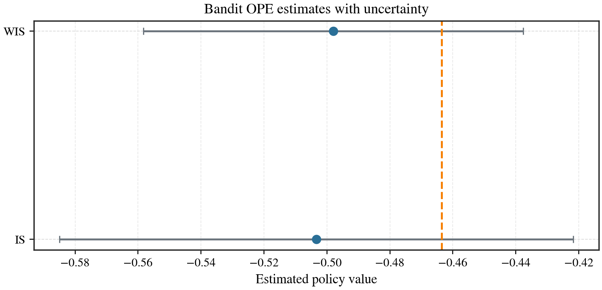
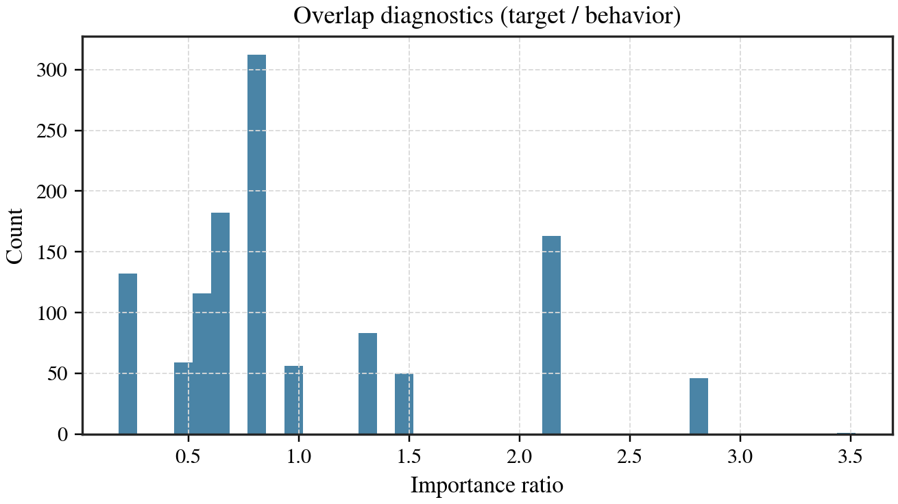
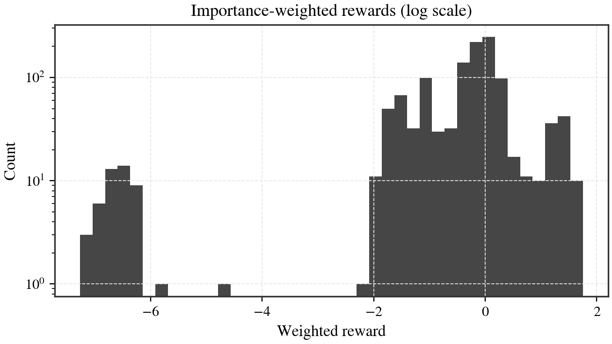
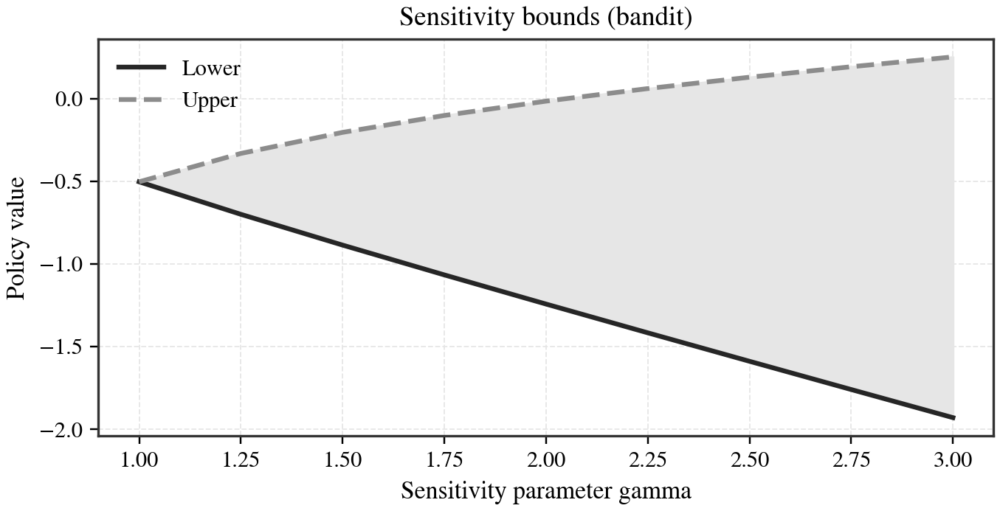
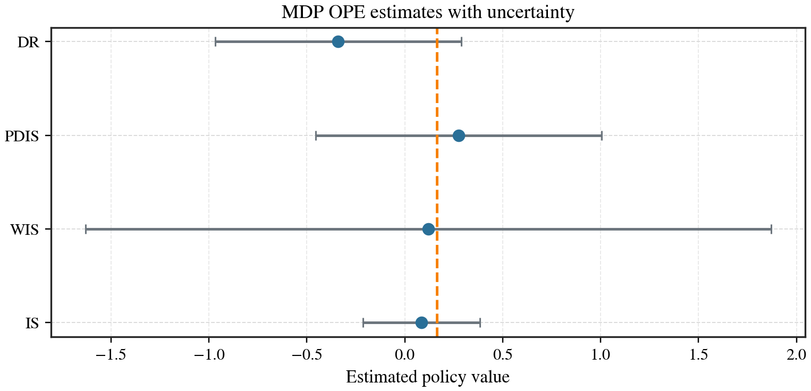
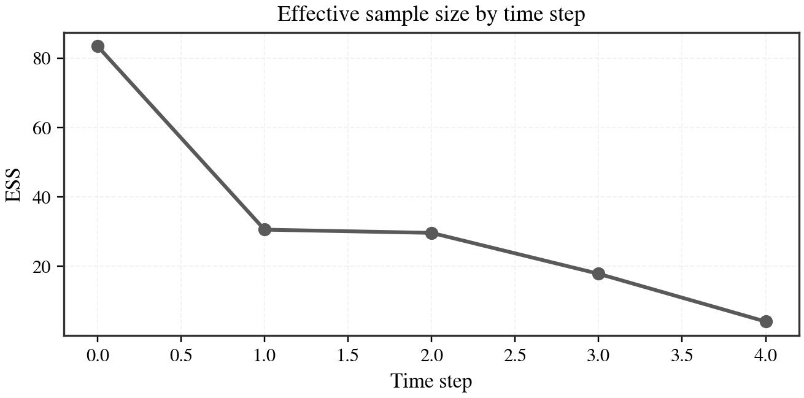

# CausalRL

<div class="crl-hero" markdown>

## Estimand-first causal RL and off-policy evaluation

<p class="crl-hero-subtitle">
Assumptions in the open. Diagnostics by default. Benchmarks you can trust.
</p>

<div class="crl-hero-actions" markdown>
[Get started](getting-started/installation.md){ .md-button .md-button--primary }
[View results gallery](results/gallery.md){ .md-button }
</div>

</div>

**Package**: `causalrl` | **Import**: `crl` | **Version**: 0.1.0 |
[GitHub](https://github.com/gsaco/causalrl)

## Why CausalRL

<div class="grid cards" markdown>

-   **OPE pipeline with reporting**
    End-to-end evaluation via `evaluate`, with summary tables and HTML reports.

-   **Diagnostics-first workflow**
    Overlap, ESS, and weight tails are explicit in every estimator report.

-   **Reproducible benchmarks**
    Synthetic bandit/MDP generators with ground-truth values for sanity checks.

-   **Sensitivity analysis**
    Bounded-confounding curves for bandits and sequential settings.

-   **Estimator selection**
    Heuristics to compare stability and model fit before choosing an estimator.

-   **Adapters and policies**
    D4RL/RL Unplugged loaders and policy wrappers for sklearn/torch models.

</div>

## 60-second quickstart

```bash
python -m pip install causalrl
```

```python
from crl.benchmarks.bandit_synth import SyntheticBandit, SyntheticBanditConfig
from crl.ope import evaluate

benchmark = SyntheticBandit(SyntheticBanditConfig(seed=0))
dataset = benchmark.sample(num_samples=1000, seed=1)
report = evaluate(dataset=dataset, policy=benchmark.target_policy)

print(report.summary_table())
```

!!! note "Scope"
    The current `evaluate` pipeline assumes discrete action spaces. See
    [Limitations](concepts/limitations.md) for details.

## Why trust it

- Explicit assumptions via `AssumptionSet`, attached to every estimand.
- Deterministic benchmark generators with fixed seeds.
- Test suite covering estimators, diagnostics, and pipelines.
- Reproducibility docs for configs and benchmark suites.

## Results gallery

<div class="crl-gallery">
  <a href="assets/figures/bandit_estimator_comparison.svg" data-gallery="home">
    
  </a>
  <a href="assets/figures/bandit_overlap_ratios.svg" data-gallery="home">
    
  </a>
  <a href="assets/figures/bandit_weighted_rewards.svg" data-gallery="home">
    
  </a>
  <a href="assets/figures/bandit_sensitivity_bounds.svg" data-gallery="home">
    
  </a>
  <a href="assets/figures/mdp_estimator_comparison.svg" data-gallery="home">
    
  </a>
  <a href="assets/figures/mdp_ess_by_time.svg" data-gallery="home">
    
  </a>
</div>

See the full [Results Gallery](results/gallery.md) for interpretations and links.

## Data contracts (read first)

Use the dataset contracts in `crl.data` and follow the shape rules exactly:

- Bandits: `LoggedBanditDataset`
- Trajectories: `TrajectoryDataset`
- Transitions: `TransitionDataset`

Start here: [Dataset Format and Validation](concepts/dataset_format.md)

## Learn by example

- [Installation](getting-started/installation.md)
- [Examples](tutorials/examples.md)
- [Estimator Reference](reference/estimators/index.md)
- [Public API](reference/api/public_api.md)
- [Sample HTML report](results/report_preview.md)

## Estimator selection

See the [Estimator Selection Guide](explanation/estimator_selection.md) for a
practical decision tree and recommended defaults.
