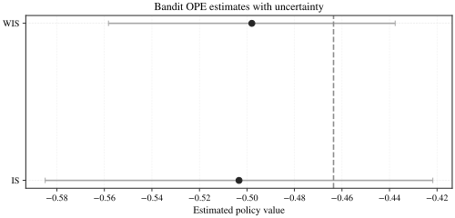

# Quickstart (Bandit)

This tutorial shows a complete bandit OPE workflow using the built-in synthetic
benchmark. It mirrors the notebook so you can follow along in Markdown or run
it interactively.

## What you will do

- Generate a logged bandit dataset with known ground truth.
- Run `crl.ope.evaluate` with multiple estimators.
- Inspect estimator diagnostics and plots.

## Walkthrough

```python
from crl.benchmarks.bandit_synth import SyntheticBandit, SyntheticBanditConfig
from crl.ope import evaluate_ope

benchmark = SyntheticBandit(SyntheticBanditConfig(seed=0))
dataset = benchmark.sample(num_samples=1000, seed=1)
report = evaluate_ope(dataset=dataset, policy=benchmark.target_policy)
```

Plot the estimator comparison and export a report:

```python
fig = report.plot_estimator_comparison(truth=benchmark.true_policy_value(benchmark.target_policy))
report.save_html("report.html")
```

<figure class="crl-figure">
  
  <figcaption>Estimator comparison rendered with the CausalRL grayscale style.</figcaption>
</figure>

## Notebook

- [02_bandit_ope_walkthrough.ipynb](https://github.com/gsaco/causalrl/blob/main/notebooks/02_bandit_ope_walkthrough.ipynb)
